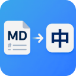

<p align="center">
  
</p>

<h1 align="center">Markdown 中文翻译器</h1>

<p align="center">
  把英文 Markdown 翻成中文，直接在编辑器里看。<br>
  开箱即用，改哪翻哪。
</p>

<p align="center">
  <a href="https://github.com/hiyeshu/md-translator-zh">GitHub</a> ·
  <a href="https://github.com/hiyeshu/md-translator-zh/issues">反馈</a>
</p>

---

## 安装

在 Cursor 扩展面板搜索 `md-translator-zh`，点安装。

或者手动装：[Releases](https://github.com/hiyeshu/md-translator-zh/releases) 下载 `.vsix` 文件，Cursor 里按 `Cmd+Shift+P` → `Install from VSIX`。

---

打开任意 `.md` 文件，按 `Cmd+Shift+T`（Windows `Ctrl+Shift+T`），左边原文右边译文。

## 特点

- **分栏预览** — 原文和译文并排，同步滚动
- **差异翻译** — 只翻改动的段落，不浪费 API 调用
- **格式保护** — 代码块、链接、表格原样保留
- **插件内设置** — 点工具栏「设置」直接配，不用跳 VS Code 设置页
- **开箱即用** — 默认免费翻译，零配置

## 服务商

| 服务商 | 配置 | 说明 |
|--------|------|------|
| 免费（默认） | 无需配置 | Google 网页端点 + MyMemory，可能限流 |
| Google | 需要 API Key | [Cloud Translation API](https://cloud.google.com/translate) |
| Azure | 需要 Key + Region | [Azure Translator](https://azure.microsoft.com/products/ai-services/ai-translator) |
| 自定义 API | 需要 Endpoint | 接你自己的翻译服务 |

切换服务商：打开翻译面板 → 点「设置」→ 选服务商 → 填 Key → 保存。

## 自定义 API 格式

你的接口会收到：

```json
{
  "texts": ["Hello world"],
  "sourceLang": "auto",
  "targetLang": "zh-CN",
  "format": "text",
  "provider": "custom"
}
```

返回 `{ "text": "..." }` 或 `{ "translations": ["..."] }` 都行。

## 命令

| 命令 | 快捷键 | 说明 |
|------|--------|------|
| 打开翻译器 | `Cmd/Ctrl+Shift+T` | 分栏翻译界面 |
| 测试连接 | 命令面板 | 检查当前服务商 |
| 清除缓存 | 命令面板 | 重新翻译所有内容 |

也可以右键 `.md` 文件打开。

## 隐私

文档内容只发给你选的翻译服务。API Key 存在本地 VS Code 设置里。免费模式走 Google 网页端点和 MyMemory，不保证稳定性。

## License

MIT
